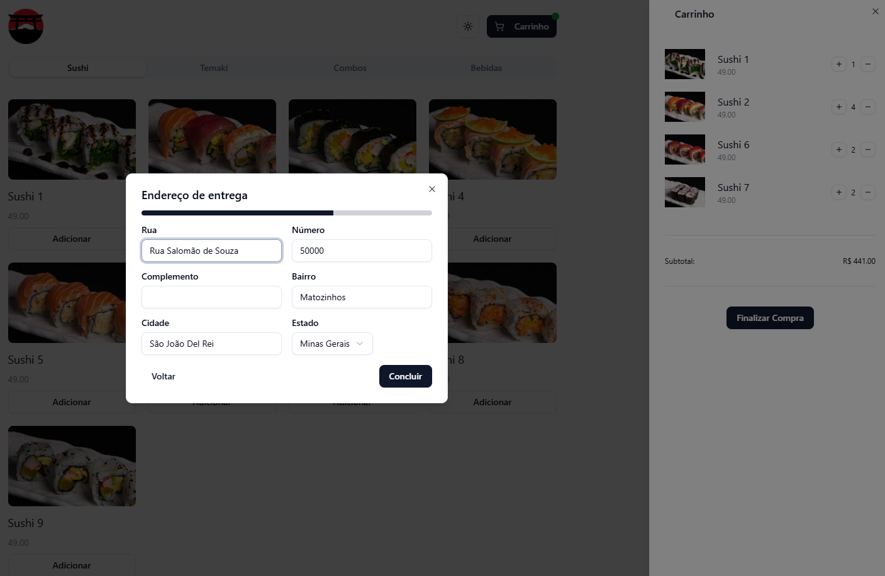

# 🍣 Plataforma de Venda de Comida Japonesa

Uma plataforma intuitiva e responsiva para a venda de comida japonesa, proporcionando uma experiência de compra fluida e eficiente. O usuário pode navegar pelo catálogo, adicionar itens ao pedido e finalizar a compra diretamente pelo WhatsApp.

## 🚀 Tecnologias Utilizadas

- **Next.js** – Framework para construção da aplicação.
- **Tailwind CSS** – Estilização moderna e responsiva.
- **ShadCN** – Componentes estilizados para uma melhor experiência do usuário.
- **Zustand** – Gerenciamento de estado leve e eficiente.
- **Zod** – Validação de dados robusta e segura.

## 📌 Funcionalidades

- Listagem de produtos de forma dinâmica.
- Adição e remoção de itens do carrinho.
- Cálculo automático do valor total do pedido.
- Integração com WhatsApp para finalização da compra.
- Interface moderna e responsiva para diferentes dispositivos.

## 🔧 Como Executar o Projeto

1. `git clone https://github.com/danielvitort/Loja-WPP`
2. `npm install`
3. Renomeie o arquivo .env.example para .env e preencha as informações de conexão com o seu WhatsApp.

## 📷 Preview

